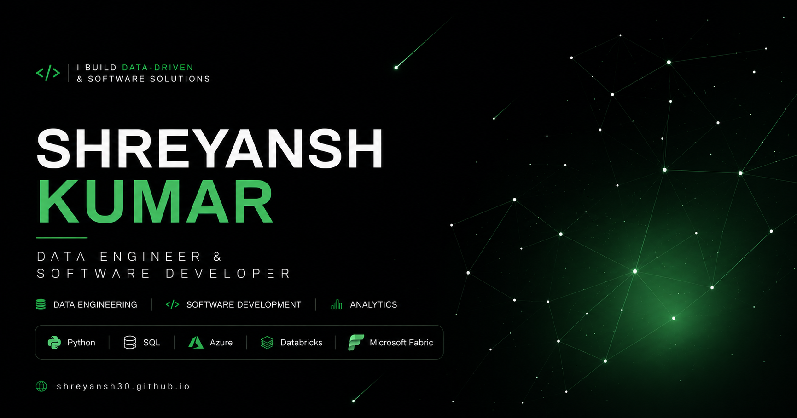

# Shreyansh Kumar | Portfolio



A modern personal portfolio website showcasing my experience, projects, skills, and journey as a **Data Engineer and Software Developer**.

Built with a focus on clean design, smooth interactions, and a professional user experience.

---

## 🌐 Live Website

[Visit Portfolio](https://shreyansh30.github.io/portfolio/)

---

## ✨ Features

- Modern dark-themed UI
- Fully responsive design
- Interactive hero section featuring:
  - Animated constellation background
  - Shooting star effects
  - Dynamic glow effects
  - Cursor glow interaction
- Smooth scroll-based animations
- Experience timeline
- Interactive project showcase
- Certificate preview system
- Resume preview and download option
- Optimized GitHub Pages deployment

---

## 🛠️ Tech Stack

### Frontend

- React
- TypeScript
- Tailwind CSS
- Vite
- Framer Motion
- Lucide React

### Tools & Deployment

- VS Code
- Git & GitHub
- GitHub Pages

---

## 📂 Project Structure

```
portfolio/
├── .github/
│   └── workflows/
│       └── deploy.yml
│
├── public/
│   ├── certificates/
│   │   ├── accenture-internship.pdf
│   │   ├── accenture-internship.png
│   │   ├── accenture.png
│   │   ├── deloitte.png
│   │   ├── deloitte-hacksplosion.png
│   │   ├── redhat.png
│   │   └── sap.png
│   │
│   ├── favicon.ico
│   ├── og-image.png
│   └── profile.jpeg
│
├── src/
│   ├── assets/
│   │
│   ├── components/
│   │   ├── About.tsx
│   │   ├── Certifications.tsx
│   │   ├── Contact.tsx
│   │   ├── CursorGlow.tsx
│   │   ├── Experience.tsx
│   │   ├── Footer.tsx
│   │   ├── Hero.tsx
│   │   ├── HeroBackground.tsx
│   │   ├── Navbar.tsx
│   │   ├── Projects.tsx
│   │   ├── Section.tsx
│   │   └── Skills.tsx
│   │
│   ├── utils/
│   │   └── publicUrl.ts
│   │
│   ├── App.tsx
│   ├── index.css
│   └── main.tsx
│
├── .gitignore
├── README.md
├── eslint.config.js
├── index.html
├── package-lock.json
├── package.json
├── tsconfig.app.json
├── tsconfig.json
├── tsconfig.node.json
└── vite.config.ts
```
## 🚀 Getting Started

### Clone the repository

```bash
git clone https://github.com/shreyansh30/portfolio.git
```

### Navigate into the project

```bash
cd portfolio
```

### Install dependencies

```bash
npm install
```

### Run development server

```bash
npm run dev
```

The application will run locally at:

```
http://localhost:5173/
```

---

## 📦 Production Build

Create an optimized production build:

```bash
npm run build
```

---

## 🎨 Design Philosophy

The portfolio follows a minimal and professional design approach:

- Dark background with green accent colors
- Clean typography
- Smooth animations instead of excessive effects
- Content-focused layouts
- Subtle interactions for better user experience

The goal is to showcase technical work while maintaining a modern developer aesthetic.

---

## 👨‍💻 About Me

I am a Computer Science Engineering student interested in building data-driven and software solutions.

My primary areas of interest include:

- Data Engineering
- Cloud Technologies
- Software Development
- Analytics Platforms

I enjoy working with modern technologies to transform ideas into practical applications.

---

## 📌 Featured Projects

Some highlighted projects include:

### Healthcare Analytics Platform

An end-to-end healthcare analytics solution built using Microsoft Fabric, PySpark, Lakehouse, Delta Tables, Semantic Models, and Power BI.

### Retail Sales Analytics Pipeline

A complete data engineering pipeline involving data ingestion, transformation, and analytics using Azure Data Factory and Azure Data Lake.

### Customer Analytics Platform

Data cleaning, transformation, and analysis project using PySpark and Databricks.

### Semantic Sales Model

A business intelligence model built using Azure Analysis Services and Power BI.

---

## 📬 Contact

GitHub:
https://github.com/shreyansh30

LinkedIn:
https://www.linkedin.com/in/shreyanshkumar30

Portfolio:
https://shreyansh30.github.io/portfolio/

---

## ⭐ Acknowledgements

Built with React, TypeScript, Tailwind CSS, and Framer Motion.

Thanks for visiting my portfolio!
